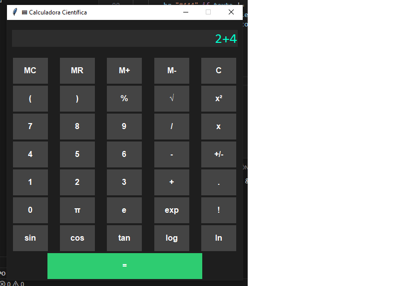

#  Calculadora Científica con Interfaz Gráfica

Esta calculadora científica fue desarrollada en Python con `tkinter` e incluye operaciones avanzadas como funciones trigonométricas, logaritmos, memoria, y más. Cuenta con una interfaz moderna y amigable.

##  Vista previa

##  Funciones destacadas

- Suma, resta, multiplicación, división
- Potencias (`x²`), raíces (`√`), porcentajes
- Funciones trigonométricas: `sin`, `cos`, `tan`
- Logaritmos (`log10`, `ln`), `exp()`, constantes como `π` y `e`
- Factorial (`x!`)
- Funciones de memoria: `MC`, `MR`, `M+`, `M-`

##  Requisitos

- Python 3.x
- Librería `tkinter` (incluida con Python)

##  Estructura

Tu proyecto debe tener al menos:
calculadora_cientifica/
├── main.py             # El script principal con la calculadora gráfica
├── README.md           # Documentación del proyecto (este archivo)
├── screenshot.png      # Captura de pantalla de la interfaz funcionando
└── calculadora.exe # El archivo ejecutable (se crea con PyInstaller)